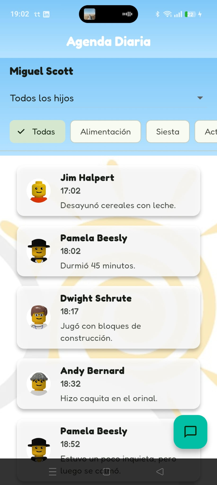

# Agenda Diaria Kids&Clouds

Bienvenido/a a Agenda Diaria, una app hecha en Flutter para que padres y madres puedan ver de forma sencilla lo que hacen sus hijos cada día en la escuela.

## Capturas de pantalla

  
  

  

  

  

## Demo Animado

  

## Demo en vídeo

Puedes descargar/ver la demo aquí:  
[▶️ Demo de Agenda Diaria (MP4)](assets/images/screenshots/Screenvideo.mp4)

## Descripción

Esta app muestra la agenda diaria de los niños, con eventos como alimentación, siestas, actividades y más. Incluye:

- Pantalla de bienvenida para acceder a la app.
- Encabezado con el nombre del padre/madre y un desplegable para seleccionar un hijo/a.
- Menú de categorías para filtrar los eventos.
- Tarjetas de eventos que muestran la hora, la descripción y la foto del niño.
- Un chat simulado para preguntar dudas al tutor.
- Diseño adaptable tanto para móvil como para escritorio.

## Cómo instalar y probar

1. Clonar el repositorio:
git clone https://github.com/Josexaser/PruebatecKidsnClouds.git

1. Moverse al proyecto:
cd PruebatecKidsnClouds-master/agenda_diaria

1. Instalar dependencias:
flutter pub get

1. Ejecutar la app:
flutter run

Para ejecutar los tests automáticos:
flutter test

## Descripción del enfoque

He organizado el proyecto separando los componentes en widgets para que el código sea más limpio y fácil de mantener. También he usado un archivo de barril (screens_export.dart) para simplificar las importaciones. La app utiliza la fuente Fredoka para un estilo más amigable. Incluye un test automático básico para comprobar que el header muestra el nombre del padre y la lista de hijos. Para la navegación he utilizado go_router. Tambien he añadido una ventana de bienvenida para mostrar el archivo router, el cual facilita la navegación entre las diferentes pantallas de la aplicación. 

## Tests

Hay un test de widget que comprueba que el header muestra correctamente el nombre del padre y la lista de hijos. Se puede ejecutar con:
flutter test

## Tecnologías usadas

- Flutter 3.x
- go_router para la navegación
- google_fonts para la fuente personalizada
- intl para formatear las horas
- Chatgpt 4o.

## Nota

Este proyecto lo he desarrollado como parte de mi aprendizaje de Flutter. He intentado seguir buenas prácticas y dejar comentarios en el código para que sea fácil de entender. Aunque finalmente quede descartado del puesto, me gustaría tener feedback para poder mejorar y optmizar mis conocimientos y habilidades. 

Gracias por la oportunidad. 
